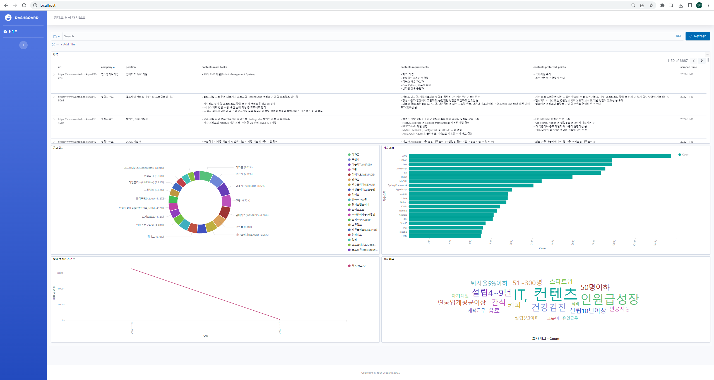

# JDA (Job Description Analysis)
[](https://www.python.org/downloads/release/python-3810/)


**JDA**는 채용 사이트의 공고 데이터들을 Elasticsearch와 Kibana를 이용하여 시각화한 프로젝트입니다.


<!-- TABLE OF CONTENTS -->
## Tables

* [Visualization](#visualization)
* [Architecture diagram](#architecture-diagram)
* [How it works](#how-it-works)
    * [Data crawling](#data-crawling)
    * [Data flow](#data-flow)
    * [Data access](#data-access)
* [Prerequisites](#prerequisites)
* [Running project](#running-project)

<!-- Visualization -->
## Visualization


<!-- ARCHITECTURE DIAGRAM -->
## Architecture Diagram


<!-- HOW IT WORKS -->
## How it works

### Data crawling
#### [원티드]
1. selenium을 이용한 공고가 모여있는 무한 스크롤 페이지를 끝까지 로딩
2. 로딩된 페이지의 HTML을 파싱하여 각 공고들의 URL 크롤링
3. 각 URL에 대하여 MongoDB에 저장되어 있는 공고들과 비교하여 새로운 공고, 사라진 공고 분류
4. 새로운 공고들에 대하여 공고 내용 크롤링 진행

### Data flow
#### [DAG]
- task1 : 공고 링크 크롤링
- task2 : 새로운 공고들에 대하여 크롤링
- task3 : 크롤링한 결과와 함께 MongoDB에 Insert & Update
- task4 : MongoDB와 Elasticsearch와 비교하여 Elasticsearch 해당 index reset 후 Insert

### Data access
- 파이썬 웹 프레임워크 **Fast API**를 통한 웹으로 Kibana dashboard 확인
- 로컬 배포 시 : http://localhost

## Prerequisites
프로젝트를 실행시키기 위해 필요한 소프트웨어.

### Install:
- [Docker](https://docs.docker.com/get-docker/)
- [Python 3.8+ (pip)](https://www.python.org/)
- [docker-compose](https://docs.docker.com/compose/install/)

## Running project
`manage.py`는 `elasticsearch`의 indices와 `kibana`의 objects를 설정 하기위한 Python 스크립트입니다.

- init project

```sh
python3 manage.py init
```
